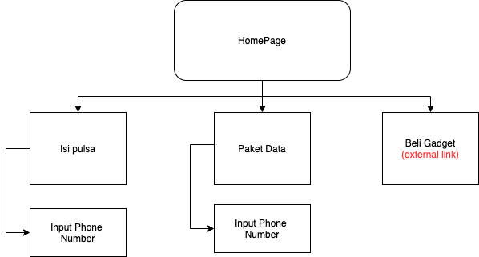
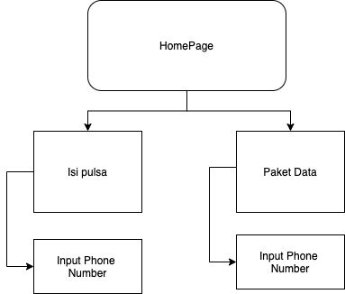
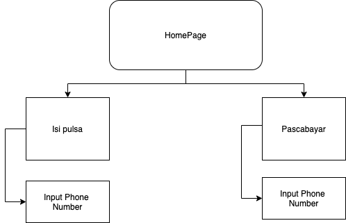

= Architecture Robusta V2

== Sitemaps

Berikut adalah arsitektur sistem dari Robusta V2:

* Sitemap Myxl
+

* Sitemap MyAxis
+

* Sitemap MyPrio
+

== *Related System*

|===
| *System Name* | *Description*

| *Civet*
| Kloningan sistem Pronghorn (_Backend_ dari sistem Robusta V2)
|===
