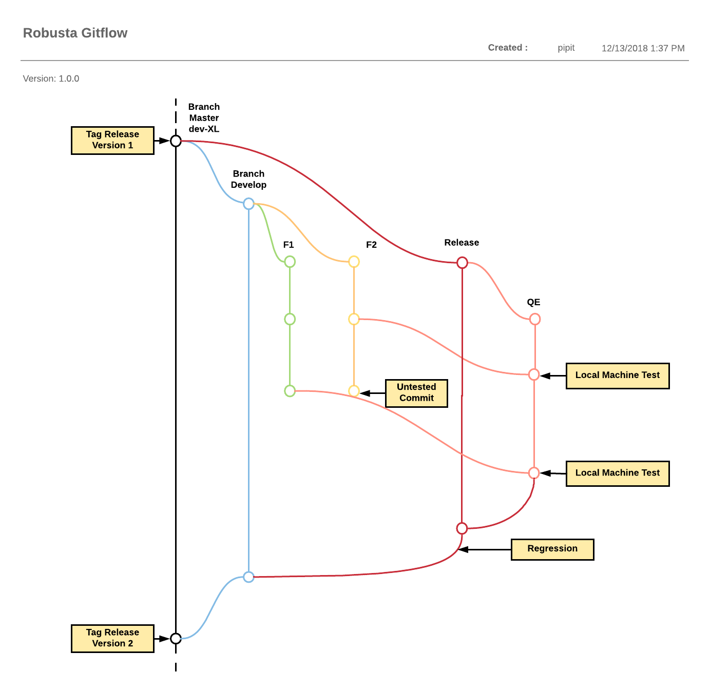

= *Development Robusta V2

== *Workflow/Gitflow*

Berikut ini merupakan _workflow/gitflow_ yang digunakan oleh sistem Robusta V2:

== Requirement

Pastikan kamu memiliki _software_ di bawah ini di dalam OS, lalu ikuti tiap instruksi agar setiap program dapat dijalankan menggunakan _command line_

* https://git-scm.com/book/en/v1/Getting-Started-Installing-Git#Installing-on-Mac
* https://changelog.com/posts/install-node-js-with-homebrew-on-os-x
* https://yarnpkg.com/en/docs/install

== Development Step

Hal-hal yang perlu diperhatikan oleh Developer saat melakukan _clone_ Robusta V2:

. Set Kraken API (setelah _create partner_ di Kraken) pada menu *Configuration\->Web Services\->Kraken API Settings* dan *at menu /admin/commerce/config/topup/provider/kraken.*
. Set Veritrans Callback.
Set client key pada setiap _payment method rules_ dan set Civet URL Callback pada menu admin Sepulsa Veritrans
. Set _header_ e-mail di _mimemail file_ (_code_)
. Set kode _product package_ di */admin/commerce/config/product-variation-types/pulsa/fields/field_package_code*
. Set _completion message_ untuk halaman "_Thank You_" di */admin/commerce/config/checkout/form/pane/*
. Set _tools_ untuk _Customer Service_ dan Ops (Contohnya _reprocess transaction_ atau kebutuhan laporan Ops)
. Set modul MDR (bersifat opsional jika partner ingin biaya MDR dibayarkan oleh pelanggan)

== Clone Repository

----
git clone https://github.com/sepulsa/frigate.git newfrigate
----

*Checkout to branch: _newfrigate_*

----
cd newfrigate
git checkout newfrigate
----

*Change to directory where main _package.json_ exist then install node_modules*

----
# execute 'yarn' on your commandline to install node_modules
azul:newfrigate/ (newfrigate✗) $ pwd
/Users/azul/Sites/newfrigate
azul:newfrigate/ (newfrigate✗) $ yarn
yarn install v0.23.4
[1/4] 🔍  Resolving packages...
----

*Save `development.env as .env`*

This is hidden configuration file to store variable depend on current environment: development or production.

Your .env must be in directory where package.json exist.

----
# copy or rename development.env to .env

azul:newfrigate/ (newfrigate✗) $ pwd
/Users/azul/Sites/newfrigate

azul:newfrigate/ (newfrigate✗) $ cp development.env .env

# show list files on current directory including hidden files
azul:newfrigate/ (newfrigate✗) $ ls -lah
total 920
drwxr-xr-x   20 azul  staff   680B May  3 17:31 .
drwxr-xr-x+  55 azul  staff   1.8K May  2 17:11 ..
-rw-r--r--    1 azul  staff   1.3K May  4 11:12 .env
drwxr-xr-x   16 azul  staff   544B May  4 15:10 .git
-rw-r--r--    1 azul  staff   226B Apr 26 11:06 .gitignore
drwxr-xr-x    3 azul  staff   102B Mar 23 21:32 .vscode
-rw-r--r--    1 azul  staff   1.9K May  4 14:15 README.md
drwxr-xr-x    9 azul  staff   306B Apr 10 10:38 config
-rw-r--r--    1 azul  staff   1.3K May  3 17:31 development.env
drwxr-xr-x  827 azul  staff    27K May  4 14:10 node_modules
-rw-r--r--    1 azul  staff   3.3K May  4 14:09 package.json
-rw-r--r--@   1 azul  staff   1.3K May  3 17:31 prod.env
drwxr-xr-x    7 azul  staff   238B Apr 10 10:38 public
drwxr-xr-x    5 azul  staff   170B Mar 16 16:18 scripts
drwxr-xr-x   15 azul  staff   510B May  2 10:18 src
-rw-r--r--    1 azul  staff   100B May  2 10:12 tsconfig.json
-rw-r--r--    1 azul  staff   197K May  4 14:10 yarn.lock
----

*To see more just open development.env file.
In this .env file we are using using Pronghorn Development as base URL web services and disabled mixpanel, hotline, & home promo (image slider) section.*

----
# Development Port, Use any port number allowed
    PORT=30**
    HOST=*.se**sa.id

    # BUILD CONFIGURATION

    # Home Promo Carousel
    REACT_APP_HOME_FAVOURITE=enable

    # Home promo carousel enable/disable
    REACT_APP_HOME_PROMO=disable

    # To enable Mixpanel fill it with mixpanel token to disable it set to ''
    REACT_APP_MIXPANEL_KEY=''

    # To enable Google Analytics fill the UA ID
    REACT_APP_GOOGLE_ANALYTICS='***'

    # Hotline set to 'true/false'
    REACT_APP_HOTLINE=false

    # Social login key
    REACT_APP_FACEBOOK_APP_ID='***'
    REACT_APP_GOOGLE_APP_ID='***'

    # Base URL for API
    REACT_APP_BUMI_URL='https://pron.sumpahpalapa.com/bumi/'
    # REACT_APP_BUMI_URL='https://pronuat-v2.sumpahpalapa.com/bumi/'
    REACT_APP_API_URL='https://pron.sumpahpalapa.com/api/'

    # Veritrans script
    REACT_APP_VERITRANS_URL='https://api.sandbox.midtrans.com/v2'
    REACT_APP_VERITRANS_JS='https://api.sandbox.midtrans.com/v2/assets/js/veritrans.min.js'
----

*To begin development mode just execute this command on your project directory*

----
yarn start
----

=== Test Mockup

=== Testing

To build scripts for testing, Edit *.env* file so that it pointed to correct environment variables.

Execute `yarn build` in your project directory then rsync 'build' or upload it to web directory for Testing
