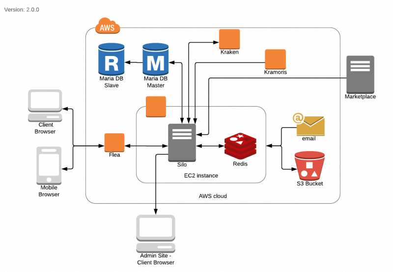

= Architecture Silo V2

== High Level Architecture

Berikut adalah arsitektur sistem Silo V2:

== Related System

|===
| *System Name* | *Description*

| Kramoris
| Platform yang digunakan untuk penjualan dan pembelian simcard dan modem.

| Pronghorn
| Merupakan klien pertama kraken yang bertugas untuk _testing_ produk.
Selain itu, Pronghorn juga bertugas sebagai _interface_ Sepulsa.

| Dolphin
| Merupakan _voucher center_ atau aplikasi yang mengatur voucher _offline_ di bawah Sepulsa.
Sistem ini dikembangkan pada akhir tahun 2016 (Desember).
|===
